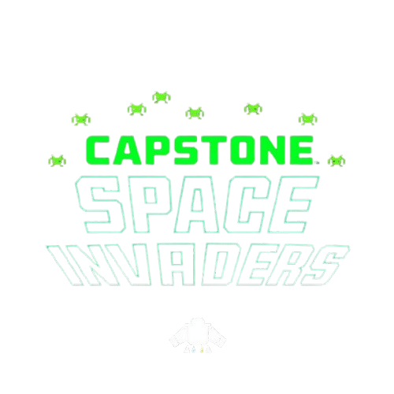

<div align="center">
  
  <h2>
   Space Invaders by Angel Gabriel Ortega Corzo
  </h2>
</div>


<div align="center">
    <a href="https://gitlab.com/jala-university1/cohort-3/oficial-es-programaci-n-3-cspr-231.ga.t1.25.m1/secci-n-d/capstone/angel.ortega/spaceinvaders/-/blob/main/LICENSE">
        
    </a>
    <a href="https://gitlab.com/jala-university1/cohort-3/oficial-es-programaci-n-3-cspr-231.ga.t1.25.m1/secci-n-d/capstone/angel.ortega/spaceinvaders/-/releases">
        
    </a>
    <a href="https://gitlab.com/jala-university1/cohort-3/oficial-es-programaci-n-3-cspr-231.ga.t1.25.m1/secci-n-d/capstone/angel.ortega/spaceinvaders/-/issues">
        
    </a>
    <a href="https://gitlab.com/jala-university1/cohort-3/oficial-es-programaci-n-3-cspr-231.ga.t1.25.m1/secci-n-d/capstone/angel.ortega/spaceinvaders/-/graphs/main">
        
    </a>
</div>

<div align="center">
  Video Game based on the classic Space Invaders game, Created in c# with windows forms.
</div>
<div align="center"><b>
<h4>See the <a href="https://gitlab.com/jala-university1/cohort-3/oficial-es-programaci-n-3-cspr-231.ga.t1.25.m1/secci-n-d/capstone/angel.ortega/spaceinvaders/-/wikis/home">docs</a> for more info.
	</h4>
</b>
</div>


<br>
<br>

<div align="center">
<h2>
🎮 About the Game</h2>

  <p>
    Space Invaders is a modern recreation of the classic arcade game, built using C# and Windows Forms. This version includes enhanced graphics, smooth controls, and new features like power-ups and a scoring system. Whether you're a fan of the original or new to the game, this project offers a fun and nostalgic experience!
  </p>
</div>

<br>
<br>

<div align="center">
  <h2>🚀 Features</h2>
  <ul align="left">
    <li>🎯 Classic Space Invaders gameplay with a modern twist.</li>
    <li>🚀 Smooth controls for an enhanced gaming experience.</li>
    <li>💥 Power-ups and special abilities to help you defeat the invaders.</li>
    <li>📊 Scoring system to track your progress and compete with friends.</li>
    <li>🎨 Retro-inspired graphics with a fresh look.</li>
  </ul>
</div>


<br>
<br>


<div align="center">
<h2>
🤝 Contributing
</h2>
</div>


We welcome contributions from the community. Before you start working with the `Space-Invaders`, please read our [contribution guidelines](/Contributing.md) to understand our development process, how to propose bug fixes and improvements, and how to build and test your changes to the project.


<br>
<br>


<div align="center">
<h2>
License 📜
</h2>
</div>

This project is licensed under the MIT License - see the [LICENSE](/LICENSE) file for details.


<br>
<br>


<div align="center">
<h2>
tecnologies used 🔧
</h2>
</div>


<div style="display: grid; grid-template-columns: repeat(auto-fill, minmax(100px, 1fr)); gap: 10px; justify-items: center;" align="center">
  
  
  
  
  
  
</div>

<div align="center">
<h2>
SetUp 💻🔌
</h2>
</div>

1. Clone the repository:

 ```bash
 
   git clone https://gitlab.com/jala-university1/cohort-3/oficial-es-programaci-n-3-cspr-231.ga.t1.25.m1/secci-n-d/capstone/angel.ortega/spaceinvaders.git
   
```

2. Open the project in Visual Studio 2022 or vscode and navigate to the folder where the project is located. and run the program. with the help toolkit of visual studio 2022. or if u use vscode, type the following comand in the terminal:

 ```bash
 dotnet run --project .\SpaceInvaders\
```

and enjoy the game. :)